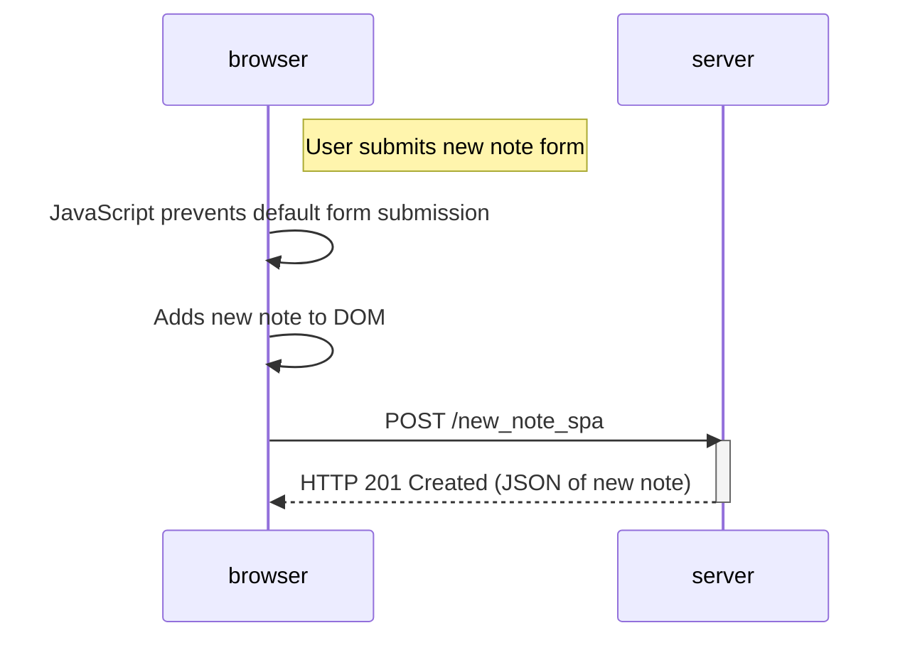

```mermaid
  sequenceDiagram
      participant browser
      participant server
  
      Note right of browser: User submits new note form
  
      browser->>browser: JavaScript prevents default form submission
      browser->>browser: Adds new note to DOM
  
      browser->>server: POST /new_note_spa
      activate server
      server-->>browser: HTTP 201 Created (JSON of new note)
      deactivate server
```
